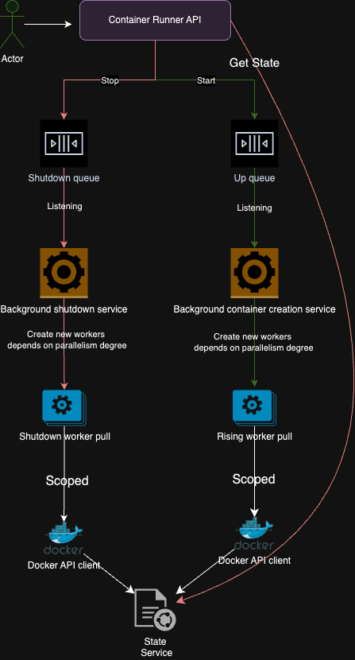

# Usage
1. Run app
2. Start numbers of containers
   (I took `sverrirab/sleep` image as example coz it just sleeps)
    ```
   for i in `seq 1 20`; do curl -d '{"name":"sverrirab/sleep","tag":"latest"}' -H "Content-Type: application/json" -X POST http://localhost:5003/containers/start; done
   ```
3. Check containers state 
    ```
    curl http://localhost:5003/containers/statusAll 
   ```
4. Stop all containers
    ```
    curl -X DELETE http://localhost:5003/containers/stopAll
   ```

# ContainerRunner (major points)
1. For interaction with Docker Engine API Docker.DotNet is used (https://github.com/dotnet/Docker.DotNet).
2. Number of worker threads for `creating worker` and `destroying worker` can be set in config.
3. Round robin principle is used to split work across workers.
3. Sync invalid http calls are handled by `user exceptions middleware`



# Assumptions
1. Config isn't validated. 
2. Code isn't covered with tests “ヽ(´▽｀)ノ”